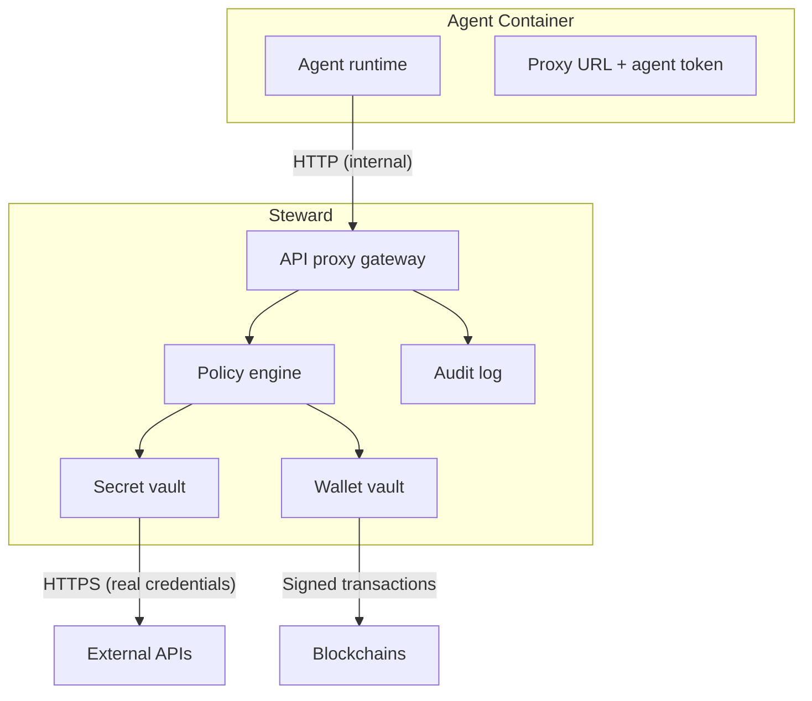
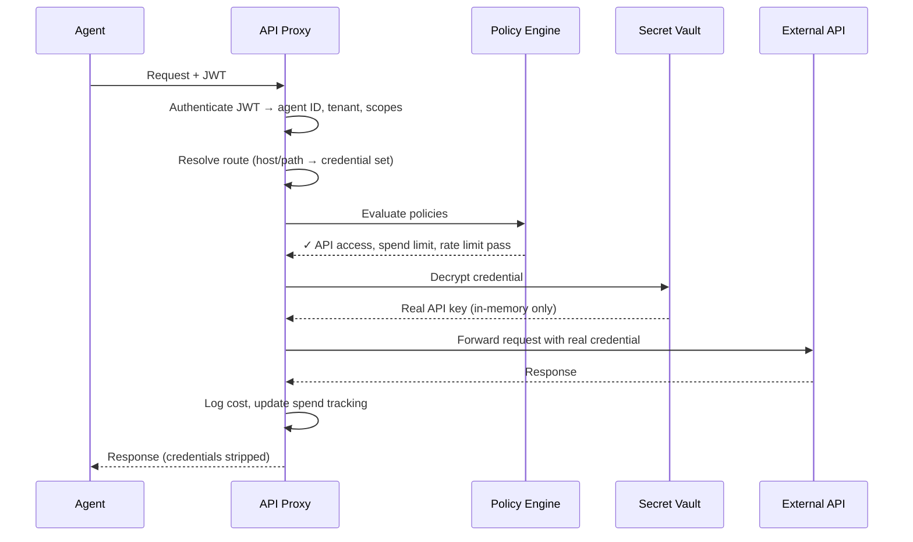
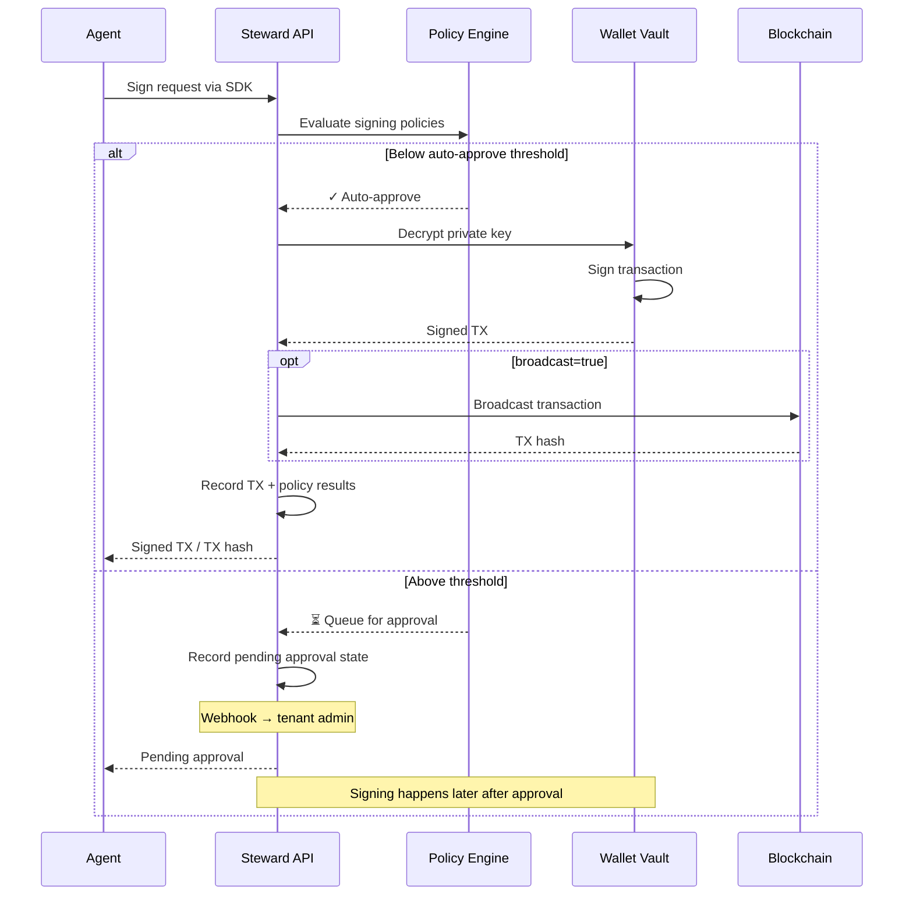
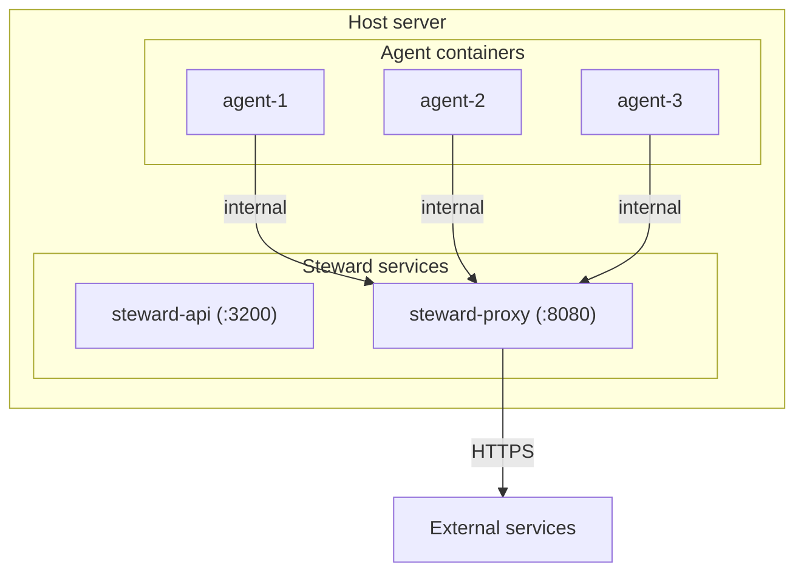
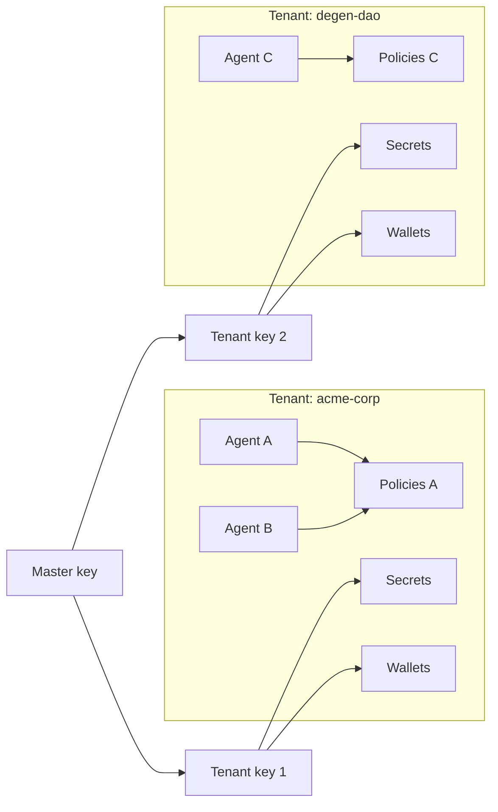

# Architecture

Steward provides governed paths for configured agent provider calls and wallet operations. Only requests routed through supported Steward integrations receive these checks and audit events. Arbitrary agent network egress remains outside the boundary.

## Three Pillars

<CardGroup cols={3}>
  <Card title="Wallet Vault" icon="vault">
    Encrypted key storage for supported signing paths. Governed routes apply policy before signing.
  </Card>
  <Card title="Secret Vault" icon="key">
    Encrypted credential storage with injection on configured proxy routes.
  </Card>
  <Card title="Policy Engine" icon="shield-check">
    Declarative policy evaluation on enrolled, governed actions. Default deny.
  </Card>
</CardGroup>

## High-Level Flow

## Request Flow: API Proxy

When an agent makes an API call (e.g., to OpenAI):

## Request Flow: Wallet Signing

When an agent needs to sign a transaction:

## Deployment Modes

Steward currently supports two database modes:

- **PostgreSQL mode** — API and proxy processes connect to PostgreSQL using `DATABASE_URL`. This is what Docker Compose and durable self-hosted deployments use.
- **Embedded/PGLite mode** — `bun run start:local` runs the API against PGLite, persisted at `~/.steward/data` unless `STEWARD_PGLITE_MEMORY=true` is set. This is intended for local development, desktop sidecars, and tests.

## Deployment Topology

<Note>
  Agent containers can be firewalled to **only reach the Steward proxy**. Even if fully compromised, an agent cannot exfiltrate data to arbitrary endpoints.
</Note>

## Multi-Tenant Isolation

Steward is multi-tenant by design:

- **Tenants** are isolated at the service layer: every tenant-scoped query filters on `tenantId` and rows carry a composite foreign key to their tenant. This is not database row-level security (RLS is not implemented).
- **Agents** authenticate with JWTs scoped to their tenant and agent ID
- **Secrets** are encrypted with per-tenant encryption keys (key hierarchy: master → tenant → secret)
- **Policies** are evaluated per-agent within their tenant context

## Tech Stack

| Component | Technology |
|-----------|-----------|
| API Server | [Hono](https://hono.dev) on [Bun](https://bun.sh) |
| Database | PostgreSQL 16 or embedded PGLite for local/dev mode |
| Encryption | AES-256-GCM with keys derived via Node `scryptSync` |
| EVM Signing | [viem](https://viem.sh) |
| Solana Signing | [@solana/web3.js](https://solana-labs.github.io/solana-web3.js/) |
| ORM | [Drizzle](https://orm.drizzle.team) |
| SDK | TypeScript, zero dependencies |
